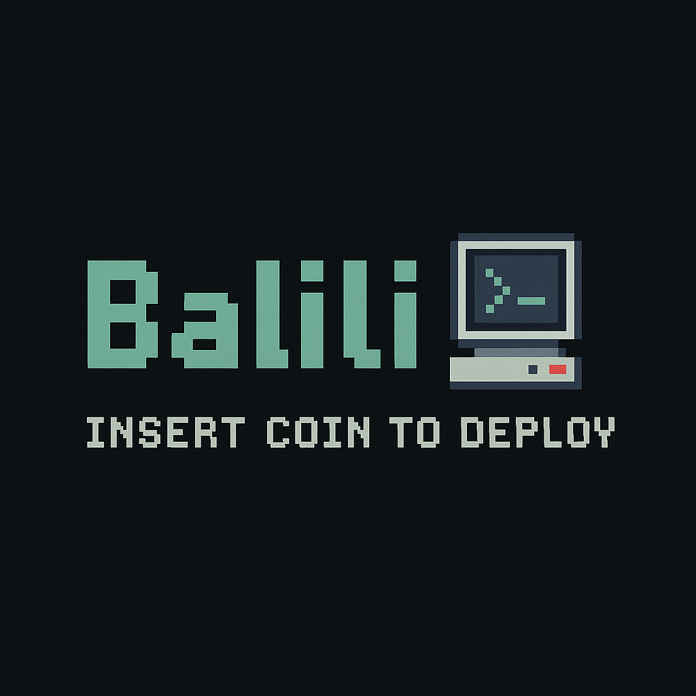

  

# Hola 👋, soy Brenda

Soy estudiante de Desarrollo Full-Stack en **Conquer Blocks**. Apasionada por la programación y el desarrollo de soluciones web, actualmente estoy fortaleciendo mis habilidades y aprendiendo nuevas tecnologías.

## 💻 Tecnologías y habilidades

- **Lenguajes:** Python, HTML, SQL (MySQL)
- **Conceptos:** Programación Orientada a Objetos (POO)
- **Front-end:** CSS (en progreso)
- **Bases de datos:** MySQL
- **Herramientas:** Git, GitHub

## 🚀 Proyectos destacados

He subido varios proyectos en mi repositorio, donde aplico los conocimientos adquiridos en mis estudios y prácticas. Algunos de ellos incluyen:

- Proyecto 1: Reloj-Despertador (https://github.com/balili92/reloj_despertador)
- Proyecto 2: Lang detect (https://github.com/balili92/detector-idioma)
- Proyecto 3: Portfolio-Persona, publicado en GitHub Pages (https://balili92.github.io/portfolio-brenda/)

Puedes ver todos mis proyectos en mi perfil de GitHub.

## 📫 Contacto

Si quieres ponerte en contacto conmigo, aquí te dejo mis redes:

Correo: balili.tech0@gmail.com

---

¡Gracias por visitar mi perfil! Siempre abierto a aprender y colaborar en nuevos proyectos.  
