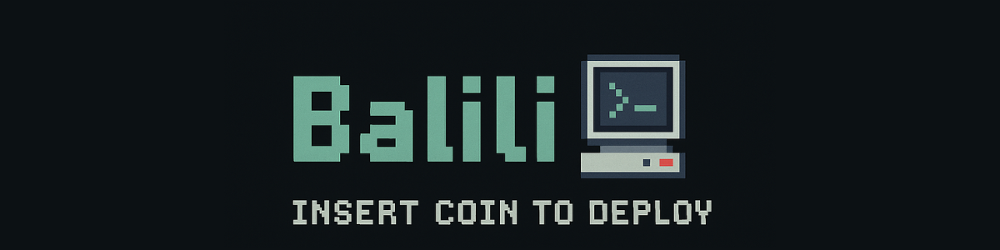

# Hola 👋, soy Brenda

Soy estudiante de Desarrollo Full-Stack en [Conquer Blocks](https://conquerblocks.com). Apasionada por la programación y el desarrollo de soluciones web, actualmente estoy fortaleciendo mis habilidades y aprendiendo nuevas tecnologías.

## 💻 Tecnologías y habilidades

## 🚀 Proyectos destacados

He subido varios proyectos en mi repositorio, donde aplico los conocimientos adquiridos en mis estudios y prácticas. Algunos de ellos incluyen:

- 📌 [Reloj-Despertador](https://github.com/balili92/reloj_despertador)
- 📌 [Lang detect](https://github.com/balili92/detector-idioma)
- 📌 [Portfolio-Personal](https://balili92.github.io/portfolio-brenda/)

Puedes ver más en la pestaña de [repositorios](https://github.com/balili92?tab=repositories) de mi perfil.

## 📫 Contacto

Si quieres ponerte en contacto conmigo, aquí te dejo mis redes:

---

¡Gracias por visitar mi perfil! Siempre abierto a aprender y colaborar en nuevos proyectos.  
